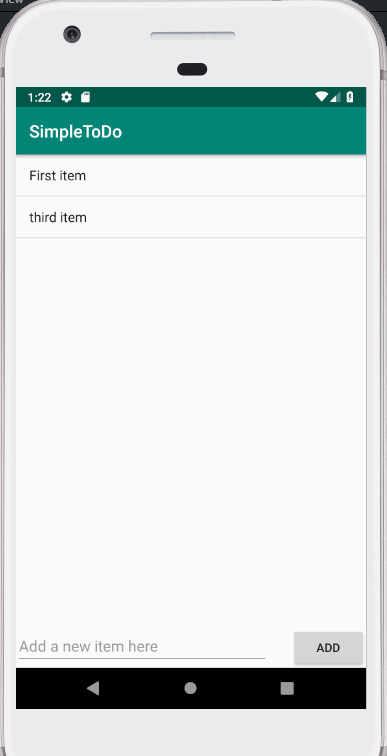

# Pre-work - *Simple ToDo*

**Name of your app** is an android app that allows building a todo list and basic todo items management functionality including adding new items, editing and deleting an existing item.

Submitted by: **Savas Sotrillis**

Time spent: **9** hours spent in total

## User Stories

The following **required** functionality is completed:

* [x] User can **successfully add and remove items** from the todo list
* [x] User can **tap a todo item in the list and bring up an edit screen for the todo item** and then have any changes to the text reflected in the todo list.
* [x] User can **persist todo items** and retrieve them properly on app restart

The following **optional** features are implemented:

* [ ] Persist the todo items [into SQLite](http://guides.codepath.com/android/Persisting-Data-to-the-Device#sqlite) instead of a text file
* [ ] Improve style of the todo items in the list [using a custom adapter](http://guides.codepath.com/android/Using-an-ArrayAdapter-with-ListView)
* [ ] Add support for completion due dates for todo items (and display within listview item)
* [ ] Use a [DialogFragment](http://guides.codepath.com/android/Using-DialogFragment) instead of new Activity for editing items
* [ ] Add support for selecting the priority of each todo item (and display in listview item)
* [ ] Tweak the style improving the UI / UX, play with colors, images or backgrounds

The following **additional** features are implemented:

* [ ] List anything else that you can get done to improve the app functionality!

## Video Walkthrough

Here's a walkthrough of implemented user stories:

GIF created with [LiceCap](http://www.cockos.com/licecap/).

## Project Analysis

As part of your pre-work submission, please reflect on the app and answer the following questions below:

**Question 1:** "What are your reactions to the Android app development platform so far? Compare and contrast Android's approach to layouts and user interfaces in past platforms you've used."

**Answer:** Making the app was an interesting experience. I done some basic programming in java and c++ but never anything like this. It was a lot of fun to attempt and it was a very huge learning experience for me. I thought developing apps would have been a much harder task but this was a lot easier then I expected. Granted, their were certain points in the project I had alot of trouble with but due to the tutorial, I was able to eventually figure it out. I have used the layouts and interfaces from javafx, but never to this extent. I feel like just by completing this tutorial, i learning more programing then most of my computer science classes put together.

**Question 2:** "Take a moment to reflect on the `ArrayAdapter` used in your pre-work. How would you describe an adapter in this context and what is its function in Android? Why do you think the adapter is important? Explain the purpose of the `convertView` in the `getView` method of the `ArrayAdapter`."

**Answer:** 
The ArrayAdapter is how the array got updated. It was much easier and neater then hardcoding the ArrayList to update. Also, in the sense of creating andrioid apps, i believe the variable types are different or can't convert from the Android Studio to String directly so ArrayAdapter in this program became a necessasity to change the ArrayList data correctly. 

After looking up convertView, it seems the purpose would be  to use the old view data, if also possible. It's mostly to make the program more efficent, rather then recreating the old view data for the ArrayList, the program just grabs it and then most likely recycles it after reusing it by using the convertView.

## Notes

Describe any challenges encountered while building the app.
I had alot of trouble using the terminal, I had to redownload it 4 times for it to work properly.
It took me about an hour to figure out where my virtual technology settings were in my bios. 
I had trouble getting AndroidStudio to use RelativeLayout instead of constraint, I ended up just copying the source code from the tutorial instead of letting it automatically change as I changed the designer window.

## License

    Copyright [yyyy] [name of copyright owner]

    Licensed under the Apache License, Version 2.0 (the "License");
    you may not use this file except in compliance with the License.
    You may obtain a copy of the License at

        http://www.apache.org/licenses/LICENSE-2.0

    Unless required by applicable law or agreed to in writing, software
    distributed under the License is distributed on an "AS IS" BASIS,
    WITHOUT WARRANTIES OR CONDITIONS OF ANY KIND, either express or implied.
    See the License for the specific language governing permissions and
    limitations under the License.
